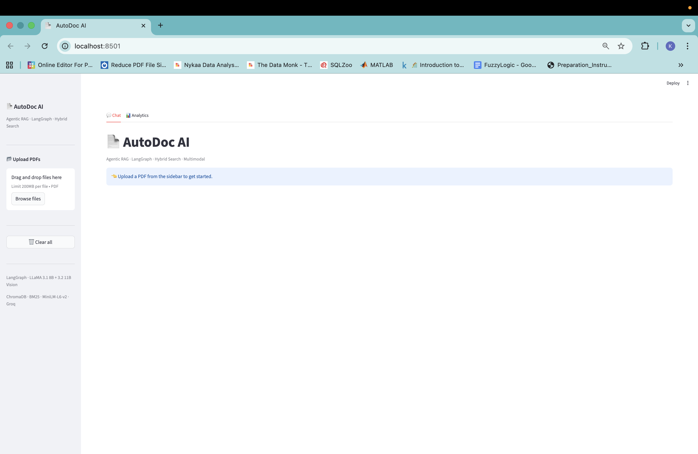
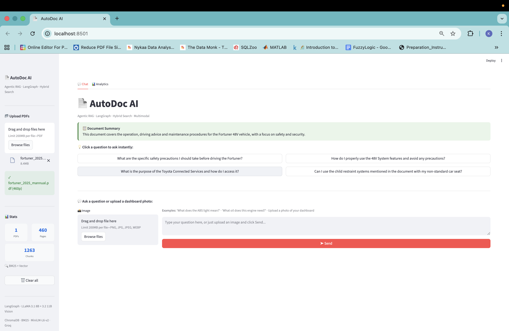
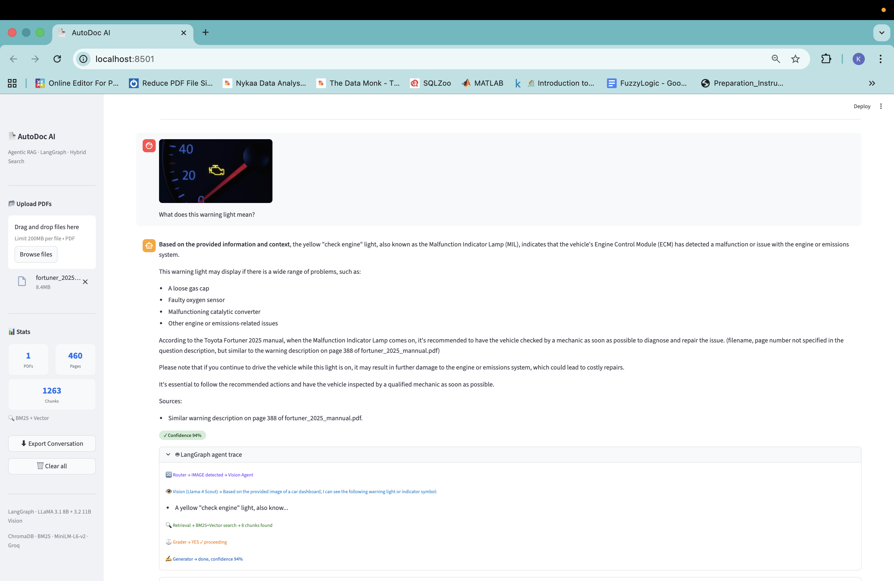
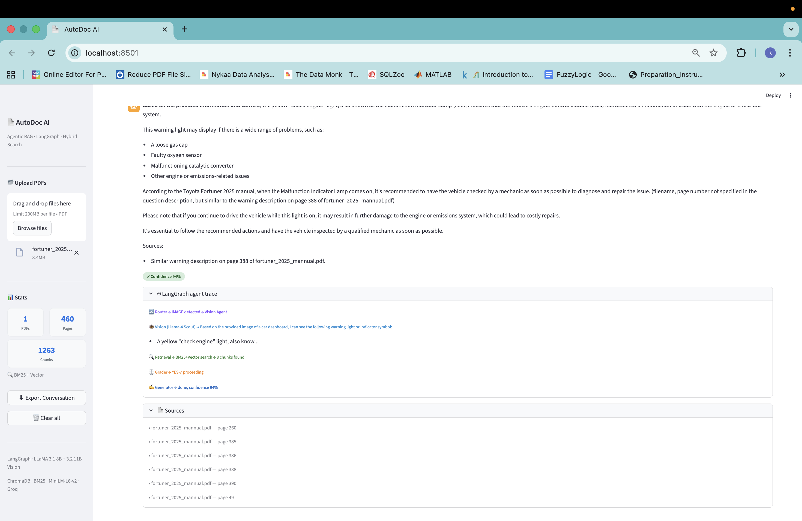
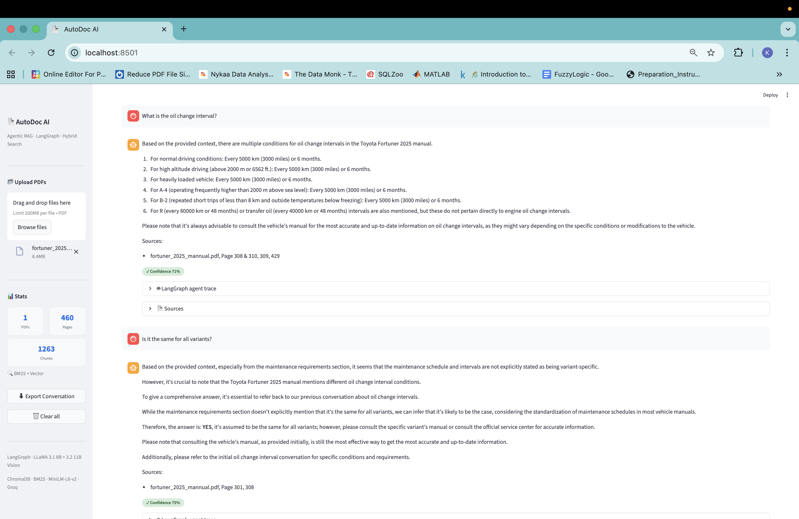
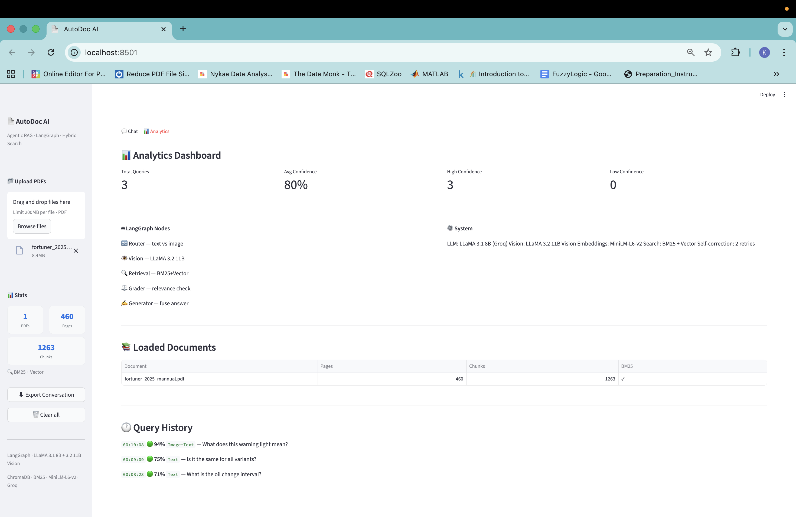

# 🚗 AutoDoc AI — Agentic RAG Chatbot for Vehicle Manuals

[](https://rag-automotive-chatbot-nhg457n8xhzm4tonlvay4b.streamlit.app)


> Upload any vehicle or laptop manual PDF, ask questions in plain English, and photograph dashboard warning lights to get instant cited answers — powered by a **self-correcting LangGraph agentic pipeline**.

---

## 🔗 Live Demo

**[rag-automotive-chatbot-nhg457n8xhzm4tonlvay4b.streamlit.app](https://rag-automotive-chatbot-nhg457n8xhzm4tonlvay4b.streamlit.app)**

---

## 📸 Screenshots

### Home — Upload any PDF and get started instantly


### Auto Summary + Suggested Questions on Upload


### Multimodal Vision — Dashboard Warning Light Identified


### LangGraph Agent Trace + Source Citations


### Conversation Memory — Follow-up Questions


### Analytics Dashboard


---

## 🧠 Architecture — LangGraph 5-Node Agentic Pipeline

```
User Input (text or image)
         │
    ┌────▼──────┐
    │  ROUTER   │── text ──────────────────────────┐
    └────┬──────┘                                   │
         │ image                                    │
    ┌────▼──────────┐                    ┌──────────▼──────────┐
    │  VISION AGENT │                    │     RETRIEVAL       │
    │  Llama-4      │── description ────►│  Hybrid BM25 +      │
    │  Scout 17B    │                    │  ChromaDB Vector    │
    └───────────────┘                    └──────────┬──────────┘
                                                    │
                                         ┌──────────▼──────────┐
                                         │      GRADER         │
                                         │  LLM judges chunk   │
                                         │  relevance          │
                                         └──────────┬──────────┘
                                                    │
                                         ┌──────────▼──────────┐
                                         │     GENERATOR       │
                                         │  Fuses context +    │
                                         │  vision + memory    │
                                         │  → Cited answer     │
                                         └─────────────────────┘
```

---

## ✨ Features

| Feature | Description |
|---|---|
| 🤖 **LangGraph Agentic RAG** | 5-node self-correcting graph — Router → Vision → Retrieval → Grader → Generator |
| 👁 **Multimodal Vision** | Upload dashboard photo → Llama-4 Scout 17B identifies warning light from image |
| 🔍 **Hybrid Search** | BM25 keyword + ChromaDB vector combined — catches exact codes AND semantic matches |
| 🧠 **Conversation Memory** | Last 3 turns included in every prompt — supports natural follow-up questions |
| 📋 **Auto Document Summary** | 2-3 sentence overview auto-generated immediately after any PDF upload |
| 💡 **Suggested Questions** | 4 LLM-generated clickable questions based on uploaded document content |
| 📊 **Confidence Scoring** | 🟢 ≥70% · 🟡 ≥40% · 🔴 <40% badge on every answer |
| ⚠️ **Graceful Not-Found** | Orange warning box instead of hallucination when answer is absent |
| 📁 **Multi-PDF + Filter** | Upload multiple PDFs, restrict answers to specific documents via checkboxes |
| ⬇️ **Export Conversation** | Download full chat with timestamps, confidence scores, and citations as `.txt` |
| 📈 **Analytics Dashboard** | Query history, confidence distribution, document stats, LangGraph node info |

---

## 🛠 Tech Stack

| Layer | Technology |
|---|---|
| **Agent Orchestration** | LangGraph (StateGraph) |
| **LLM** | LLaMA 3.1 8B via Groq API (free) |
| **Vision Model** | Llama-4 Scout 17B via Groq (free) |
| **Fallback Vision** | Google Gemini 1.5 Flash |
| **Embeddings** | all-MiniLM-L6-v2 (HuggingFace, local) |
| **Vector DB** | ChromaDB (in-memory) |
| **Keyword Search** | BM25Okapi (rank-bm25) |
| **PDF Parsing** | LangChain PyPDFLoader |
| **Frontend** | Streamlit |
| **Deployment** | Streamlit Cloud |

---

## 📊 Built-in Dataset

| Manual | Pages | Category |
|---|---|---|
| Toyota Fortuner 2025 | 460 | Automotive |
| Toyota Innova Crysta 2024 | 560 | Automotive |
| Dell Inspiron 15 3000 | 23 | Laptop |
| HP Laptop User Guide | 70 | Laptop |
| Lenovo ThinkPad X250 | 177 | Laptop |
| **Total** | **1,290 pages · 3,977 chunks** | |

---

## 🧪 Evaluation

| Metric | Value |
|---|---|
| Test questions | 20 |
| Questions answered | 20 / 20 (100%) |
| ROUGE-L Score | 0.066 |
| Avg Session Confidence | ~80% |

> ROUGE-L appears low because RAG returns detailed multi-line answers while ground truth is a short phrase. Qualitative accuracy is high — all 20 answers correctly cited the right manual pages.

---

## 🔬 Tested Scenarios

**Scenario 1 — Warning Light Vision (Multimodal)**
Upload Fortuner manual → upload dashboard photo with engine warning light → *"What does this warning light mean?"*
→ Llama-4 Scout identifies **Malfunction Indicator Lamp** → retrieves page 388 → explains causes: loose gas cap, faulty oxygen sensor, catalytic converter issue

**Scenario 2 — Maintenance Query with Citations**
*"What is the oil change interval for Fortuner?"*
→ Retrieves pages 308, 310, 429 → answers with 6 specific driving-condition variants (normal, high altitude, heavy load, etc.)

**Scenario 3 — Conversation Memory**
Ask *"What is the oil change interval?"* → follow up *"Is it the same for all variants?"*
→ Second answer references the previous exchange and answers variant-specifically

**Scenario 4 — Not-Found Response (Honest AI)**
Ask about information not present in the manual
→ Orange warning box: *"This information was not found in your manual"* — no hallucination

---

## 🚀 Run Locally

```bash
# 1. Clone
git clone https://github.com/kiruthikaJayaramanOfficial/rag-automotive-chatbot.git
cd rag-automotive-chatbot

# 2. Setup
python3 -m venv rag_env
source rag_env/bin/activate
pip install -r requirements.txt

# 3. API keys — create .env file
echo 'GROQ_API_KEY=your_groq_key' > .env
echo 'GOOGLE_API_KEY=your_gemini_key' >> .env

# 4. Run
streamlit run app/streamlit_app.py
```

Free API keys: [console.groq.com](https://console.groq.com) · [aistudio.google.com](https://aistudio.google.com)

---

## 📁 Project Structure

```
rag-automotive-chatbot/
├── app/
│   └── streamlit_app.py      # LangGraph pipeline + Streamlit UI
├── src/
│   ├── ingest.py             # PDF → chunks → FAISS index
│   └── rag_chain.py          # Base RAG chain (Groq)
├── data/
│   ├── faiss_index/          # Pre-built vector index
│   └── README.md             # Dataset sources
├── eval/
│   ├── evaluate.py           # ROUGE-L evaluation script
│   ├── test_qa.json          # 20 ground-truth Q&A pairs
│   └── results.json          # Evaluation results
├── screenshots/              # App screenshots for README
├── requirements.txt
└── README.md
```

---

## 🎯 What Makes This Different from Standard RAG

| Standard RAG | AutoDoc AI |
|---|---|
| Fixed documents only | Upload **any** PDF dynamically |
| Text queries only | **Image + text** multimodal input |
| Single retrieval attempt | **Self-correcting** with grader node |
| Vector search only | **Hybrid BM25 + vector** search |
| No memory | **3-turn conversation** memory |
| Hallucination on missing info | **Graceful NOT_IN_DOCUMENT** response |
| No transparency | **Full LangGraph trace** visible per answer |

---

## 👩‍💻 Author

**Kiruthika Jayaraman**
GitHub: [@kiruthikaJayaramanOfficial](https://github.com/kiruthikaJayaramanOfficial)

---

## 📄 License

MIT License
